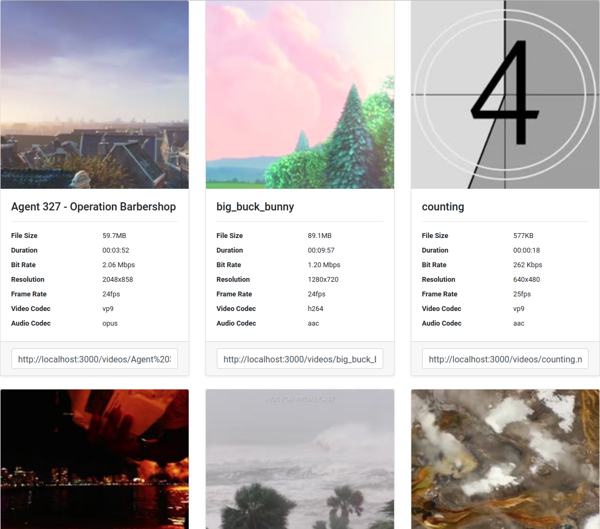

# tartare
HTML5 Video Library


## Features
- Thumbnails
- Video Information
- Copy-paste direct link

## Limitations
- No transcoding
- No web player
- No support for old browsers

## Installation

### Install through docker
- `docker run -p 3000:3000 -v '/my/videos:/videos:ro' -v 'tartare_cache:/cache' xmb5/tartare`
    - now go to http://localhost:3000
- [Sample docker-compose.yml](docker-compose.yml)

### Or, install the traditional way
Tartare requires [node.js](https://nodejs.org/), npm, [ffmpeg](https://www.ffmpeg.org/), and ffprobe.
```shell script
# download
git clone https://github.com/XMB5/tartare
cd tartare
# install dependencies
npm i
# run
TARTARE_VIDEOS=/my/videos TARTARE_CACHE=/tartare_cache node tartare.js
# web server running on http://localhost:3000
```

## Options
All options are passed through environment variables
- `TARTARE_VIDEOS`
    - directory with video files
    - required, except for docker
        - docker default: /videos
- `TARTARE_CACHE`
    - directory to store cache
    - should be on a persistent file system
        - if it's in /tmp, thumbnails and video information will have to be regenerated every reboot
    - required, except for docker
        - docker default: /cache
- `TARTARE_HOST`
    - host for web server to listen on
    - optional
        - default: localhost
- `TARTARE_PORT`
    - port for web server to listen on
    - optional
        - default: 3000

## License
Released under the [MIT License](license.md)